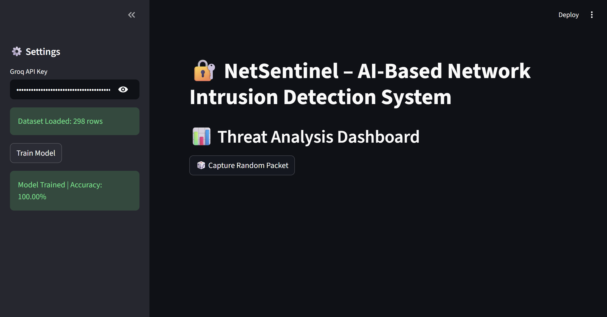

# 🔐 NetSentinel – AI-Based Network Intrusion Detection System

NetSentinel is an AI-powered Network Intrusion Detection System (NIDS) designed to detect malicious network activity, specifically **DDoS attacks**, using machine learning techniques. It combines traditional ML models with AI-based explanations to provide both accurate detection and interpretability.

> 🚀 A machine learning–based cybersecurity tool that identifies and explains network attacks in real time.

---

## 🚀 Features

### 🔍 Intrusion Detection

* Detects **DDoS attacks vs normal (benign) traffic**
* Uses a trained **Random Forest classifier**

### 🧠 AI-Based Explanation

* Integrates with **Grok AI** to explain why traffic is classified as malicious
* Improves interpretability of ML predictions

### 📊 Real-Time Simulation

* Simulates network packets from dataset samples
* Allows interactive testing of predictions

### 🖥️ Interactive Interface

* Built using **Streamlit**
* User-friendly interface for testing and visualization

---

## 🛠️ Tech Stack

* **Programming Language:** Python
* **Machine Learning:** Scikit-learn (Random Forest)
* **Frontend:** Streamlit
* **Data Processing:** Pandas, NumPy
* **AI Integration:** Grok API

---

## 📁 Project Structure

```
netsentinel/
├── src/
│   └── app.py
├── dataset/
├── screenshots/
├── requirements.txt
└── README.md
```

---

## 🧠 How It Works

1. The system loads network traffic data from the **CIC-IDS2017 dataset**
2. Relevant features (e.g., packet size, flow duration, traffic rate) are extracted
3. A **Random Forest model** is trained on labeled traffic data
4. The model classifies incoming traffic as:

   * **BENIGN** (normal traffic)
   * **DDoS** (attack traffic)
5. The result is optionally explained using **Grok AI**

---

## 📊 Dataset

* **Dataset Used:** CIC-IDS2017
* Contains real-world network traffic data
* Includes both normal and malicious traffic patterns
* Widely used benchmark dataset for intrusion detection systems

---

## ▶️ Installation & Setup

### 1. Clone Repository

```bash
git clone https://github.com/Shreyas26X/netsentinel.git
cd netsentinel
```

### 2. Install Dependencies

```bash
pip install -r requirements.txt
```

### 3. Run Application

```bash
streamlit run src/app.py
```

---

## 🎥 Demo


---

## 📸 Screenshots

### 🏠 Main Interface



### 📊 Prediction Output


---

## 📈 Results

* Successfully classifies network traffic into **benign or malicious categories**
* Demonstrates effective use of **Random Forest for intrusion detection**
* Enhances transparency through **AI-based explanations**

---

## 🔐 Security Considerations

* API keys are not exposed in the repository
* Environment variables should be used for sensitive configurations
* Input validation ensures stable prediction behavior

---

## 🚀 Future Enhancements

* Real-time packet capture using network interfaces
* Support for multiple attack types (SQL Injection, Port Scanning, etc.)
* Deployment on cloud infrastructure
* Integration with SIEM tools
* Advanced deep learning models for anomaly detection

---

## 📌 Conclusion

NetSentinel demonstrates how machine learning can be effectively applied in cybersecurity to detect and analyze network intrusions. By combining predictive models with explainable AI, it provides both accuracy and transparency, making it a practical tool for modern security systems.

---

⭐ If you found this project useful, consider giving it a star!

